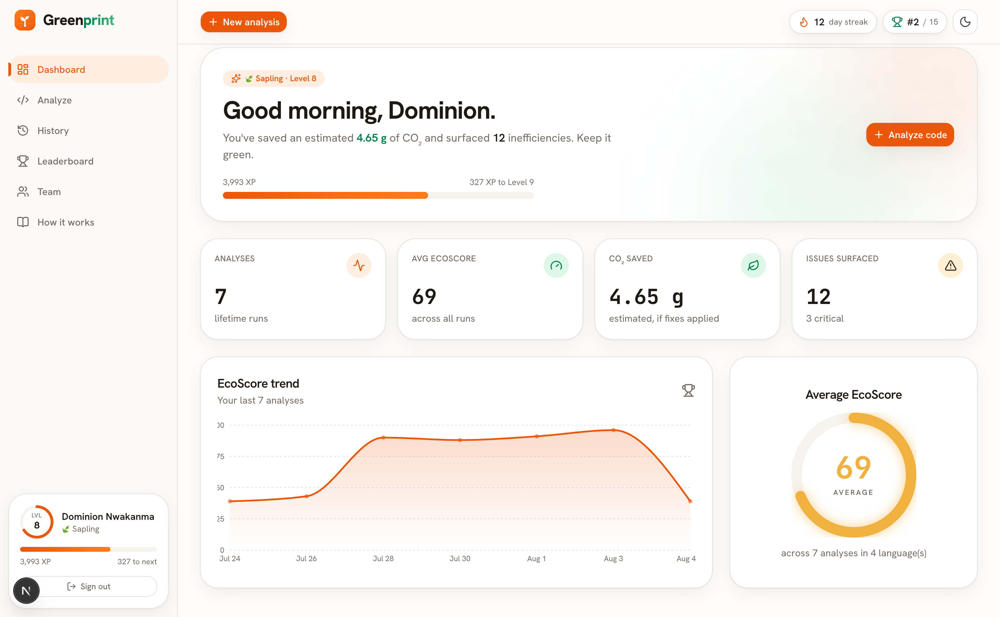
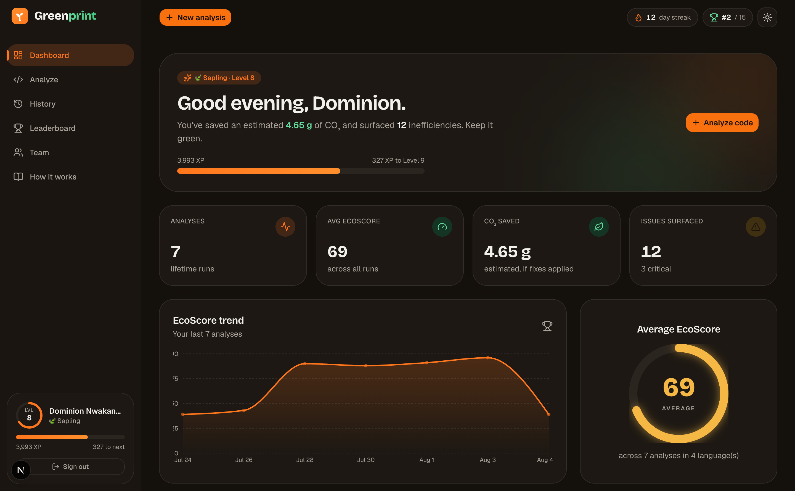

<div align="center">

# 🌱 Greenprint

### A green blueprint for your code.

**A Sustainable AI Code Assistant Dashboard** - it analyses your code for wasteful patterns,
estimates its energy & CO₂ cost, and coaches you toward faster, greener alternatives.

`SOE 508 · Special Topics in Software Engineering · Group 3 · FUTO`

### ▶ [Live demo - greenprint-eta.vercel.app](https://greenprint-eta.vercel.app)

_Click **Book a demo** → **"Use a demo account"**, or sign in with any `name@greenprint.demo` email, password **`greenprint`**._

</div>

<div align="center">


</div>

---

## What is Greenprint?

Most tools tell you if your code *works*. Greenprint tells you what it *costs the planet*.

Paste or upload a snippet and Greenprint instantly (and **fully offline**) gives it an
**EcoScore** out of 100, detects inefficient patterns (nested loops, N+1 database queries,
exponential recursion, and 15+ more), estimates the execution time, energy and CO₂ it would
burn, and hands you a concrete greener fix for every problem. Then it makes improving your
code a game - you earn XP, keep streaks, unlock badges, and climb your team's leaderboard.

|  |  |
|---|---|
|  |  |

---

## ✨ Features

| # | Requirement | How Greenprint delivers it |
|---|---|---|
| 1 | Secure authentication | Email + password via **Better Auth** (hashed, session cookies) |
| 2 | Code editor / upload | **CodeMirror 6** editor + file upload + built-in examples |
| 3 | AI-assisted explanation | Plain-English "Explain this code" (Claude, or offline demo mode) |
| 4 | AI-generated documentation | One-click "Auto-document" per function |
| 5 | Code quality analysis | Cyclomatic complexity, nesting, maintainability index, duplication |
| 6 | Inefficiency detection | 21-rule engine: nested loops, N+1, `SELECT *`, exponential recursion… |
| 7 | Energy-efficient alternatives | Every issue ships with a specific greener fix + example |
| 8 | Sustainability dashboard | EcoScore trend, CO₂ saved, quality & green metrics, charts |
| 9 | Exportable reports | Download any analysis as **PDF** or **CSV** |

**Green features:** resource-intensive code detection · algorithmic optimization advice ·
efficient AI response caching · optimized database access · lightweight, dependency-free
analysis engine · real + modelled execution-time / resource measurement.

**Gamification:** EcoScore & grades · XP and levels (Seedling → Ancient Forest) · streaks ·
12 badges · team leaderboard.

---

## 🚀 Quick start (this is all you need)

**Prerequisites:** [Node.js](https://nodejs.org) **20.9 or newer** (comes with `npm`). Nothing else -
no database to install, no API keys, no native build tools.

```bash
# 1. get the code
git clone <your-repo-url>
cd greenprint

# 2. install dependencies
npm install

# 3. run it
npm run dev
```

Then open **[http://localhost:3000](http://localhost:3000)**.

> The **first `npm run dev` sets everything up for you**: it creates a `.env` file with a fresh
> secret, creates the local SQLite database, runs the migrations, and seeds demo data (the 15
> team members, a populated leaderboard, and a sample history). No manual steps.

### Log in with a demo account

Every seeded account uses the password **`greenprint`**. For example:

| Email | Password |
|---|---|
| `dominion.nwakanma@greenprint.demo` | `greenprint` |
| `victor.ozuzu@greenprint.demo` | `greenprint` |

(On the login page you can also click **"Use a demo account"** to auto-fill.) The full list of
accounts is on the in-app **Team** page. Or just click **Create an account** to make your own.

### (Optional) Turn on live AI

The core analysis is 100% offline. The two AI panels ("Explain" and "Auto-document") work out of
the box in a built-in **demo mode**. To upgrade them to live Claude responses, add a key to `.env`:

```bash
ANTHROPIC_API_KEY=sk-ant-...
```

---

## 🧰 Scripts

| Command | What it does |
|---|---|
| `npm run dev` | Set up the DB (first run) and start the dev server |
| `npm run build` | Production build (also type-checks everything) |
| `npm start` | Run the production build |
| `npm run db:reset` | Wipe and re-seed the local database |
| `npm run smoke` | Run the analysis engine against sample code (sanity check) |
| `npm run lint` | Lint the project |

---

## 🗂️ Project structure

```
greenprint/
├── src/
│   ├── app/                    # Next.js App Router pages
│   │   ├── (auth)/             # login / signup (branded split screen)
│   │   ├── (app)/              # dashboard, workspace, history, leaderboard, team, rules
│   │   ├── api/auth/[...all]/  # Better Auth endpoints
│   │   └── page.tsx            # public landing page
│   ├── components/
│   │   ├── greenprint/         # design-system components (gauge, badges, charts…)
│   │   ├── app/                # feature components (workspace, editor, results, AI panel…)
│   │   └── ui/                 # shadcn/ui primitives
│   └── lib/
│       ├── analysis/           # ⭐ the offline analysis engine (pure TypeScript)
│       ├── db/                 # Drizzle schema, migrations, seed, one-command setup
│       ├── game/               # XP, levels, badges, streaks
│       ├── ai/                 # Claude integration + response cache + demo fallback
│       ├── actions.ts          # Server Actions (analyze + save + gamify)
│       ├── data.ts             # database read queries
│       └── team.ts             # the Group-3 roster
├── docs/                       # ARCHITECTURE, ROADMAP, DEFENSE-GUIDE, screenshots
└── drizzle/                    # generated SQL migrations
```

---

## 🛠️ Tech stack

**Next.js 16** (App Router, Turbopack) · **React 19** · **TypeScript** · **Tailwind CSS v4** ·
**shadcn/ui** · **Better Auth** · **Drizzle ORM + libSQL/SQLite** · **Anthropic Claude** (optional) ·
**Motion** · **CodeMirror 6** · **Recharts** · **jsPDF**.

Everything is current, non-deprecated tooling as of the build date.

---

## ☁️ Deployment

Live on **Vercel** with a **Turso** (libSQL) cloud database. Because the engine is libSQL-native,
going live needed **no code changes** - just point `DATABASE_URL` / `DATABASE_AUTH_TOKEN` at Turso.
Local dev still uses the offline SQLite file, so teammates run it with zero setup. Production env
vars: `DATABASE_URL`, `DATABASE_AUTH_TOKEN`, `BETTER_AUTH_SECRET`, `BETTER_AUTH_URL` (+ optional
`ANTHROPIC_API_KEY`). Pushes to `main` auto-deploy.

## 📚 Documentation

- **[docs/ARCHITECTURE.md](docs/ARCHITECTURE.md)** - how the system is put together (technical).
- **[docs/DEFENSE-GUIDE.md](docs/DEFENSE-GUIDE.md)** - plain-English guide for the presentation: what
  every part does and what each team member should be ready to explain.
- **[docs/ROADMAP.md](docs/ROADMAP.md)** - how it was built and the team's engineering rules.

---

<div align="center">

Built by **Group 3** - Federal University of Technology, Owerri · SOE 508.

</div>
