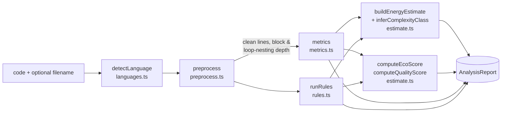

# Greenprint — Technical Architecture

**Greenprint** is a *Sustainable AI Code Assistant Dashboard*: paste or upload source
code and it statically analyses the code for inefficient / wasteful patterns, estimates
its energy and CO₂ cost, suggests greener alternatives, offers optional AI explanation and
auto-documentation, and gamifies the whole loop (EcoScore, XP, levels, ranks, badges,
streaks and a team leaderboard).

> Course project — **SOE 508 · Special Topics in Software Engineering · Group 3 · Federal
> University of Technology, Owerri (FUTO)**. See `src/lib/team.ts` for the 15-member roster
> and each member's owned subsystem.

---

## 1. System overview

Greenprint is a single **Next.js 16** application (App Router, Turbopack, React 19,
TypeScript) that renders almost everything on the server and mutates state through **Server
Actions**. There is no separate backend service: the database is a local SQLite file
(`greenprint.db`) accessed with **Drizzle ORM + libSQL**, auth is **Better Auth**, and the
core analysis engine is **pure, dependency-free TypeScript** that runs in-process.

```
┌────────────────────────────────────────────────────────────────────────┐
│ Browser (React 19 client components: editor, charts, reward overlay)     │
└───────────────▲───────────────────────────────────────────┬────────────┘
                │ Server Action calls / <form> posts          │ HTML (RSC)
┌───────────────┴───────────────────────────────────────────▼────────────┐
│ Next.js 16 server (App Router)                                           │
│                                                                          │
│  Server Components ─ read via  src/lib/data.ts   (server-only queries)   │
│  Server Actions   ─ write via  src/lib/actions.ts                        │
│                                                                          │
│   ┌───────────────┐   ┌───────────────┐   ┌───────────────┐             │
│   │ analysis/     │   │ game/         │   │ ai/           │             │
│   │ (pure engine) │   │ xp·levels·    │   │ Claude + cache│             │
│   │ offline       │   │ badges        │   │ + demo mode   │             │
│   └───────────────┘   └───────────────┘   └───────────────┘             │
│           │                   │                   │                      │
│   ┌───────┴───────────────────┴───────────────────┴───────┐             │
│   │ Better Auth (src/lib/auth.ts)  ·  Drizzle ORM          │             │
│   └───────────────────────────┬───────────────────────────┘             │
└───────────────────────────────┼─────────────────────────────────────────┘
                                 ▼
                     libSQL → greenprint.db (local SQLite file)
                     Optional: ANTHROPIC_API_KEY → Claude API
```

Everything except the two AI panels works **100 % offline with zero configuration** — no
API key, no external database, no service to provision.

### Request lifecycle — analysing a snippet

1. A visitor opens a route under the `(app)` route group. `src/app/(app)/layout.tsx`
   (a Server Component) calls `getSession()` (`src/lib/session.ts`); an unauthenticated
   visitor is `redirect()`-ed to `/login`. Otherwise it loads the gamification profile
   (`ensureProfile`), rank and leaderboard position (`getUserRank`, `getTotalPlayers`) and
   renders the `AppShell` chrome (`src/components/app/app-shell.tsx`).
2. On `/workspace`, `WorkspaceClient` (`src/components/app/workspace-client.tsx`, a client
   component) holds the editor state and calls the Server Action
   **`analyzeAndSaveAction`** (`src/lib/actions.ts`).
3. The action re-verifies the session, runs the **pure** `analyzeCode()`
   (`src/lib/analysis/index.ts`), then persists an `analysis` row, awards XP
   (`computeXpAward`), advances the streak (`nextStreak`), recomputes level
   (`levelFromXp`), updates `game_profile`, and evaluates newly-earned badges
   (`evaluateBadges`).
4. It calls `revalidatePath("/dashboard" | "/history" | "/leaderboard")` and returns the
   full report plus XP / level-up / streak / badge deltas.
5. The client shows a `sonner` toast and, on a level-up or new badge, a celebratory
   `RewardOverlay`. Results (`AnalysisResults`) and the optional `AiPanel` render inline.
6. The **AI panel** is lazy: clicking *Explain* / *Document* triggers `explainCodeAction`
   / `generateDocsAction`, which hit the SQLite AI cache first and only call Claude on a
   miss (and only when a key is present — otherwise a deterministic demo answer).

---

## 2. The analysis pipeline

The engine lives in `src/lib/analysis/` and is orchestrated by `analyzeCode()` in
`index.ts`. It is **synchronous, pure, and free of any third-party dependency or network
call** — the same function would run unchanged in a Server Action, in the browser, or in a
Web Worker. It also times *itself* (`performance.now()`) to report a real, honest
`analysisDurationMs` alongside the modelled estimates.



### Stage by stage

| Stage | File | What it does |
|---|---|---|
| **Detect language** | `languages.ts` | `detectLanguage(code, filename?)` — trusts the file extension first (`EXTENSION_MAP`), else sniffs content with cheap high-signal regexes. Supports 12 languages (`SUPPORTED_LANGUAGES`); falls back to `unknown` (still analysed, just without language-specific rules). |
| **Pre-process** | `preprocess.ts` | A char-level state machine blanks every comment and string literal (preserving line/brace layout) so regex rules never fire inside a string or comment. In the same pass it computes, per line, the enclosing **block depth** (brace depth for C-like/SQL, indentation levels for Python/Ruby) and **loop-nesting depth**, plus `loopHeaderLines`, `nestedLoopLines`, `maxLoopNesting`. This shared structural context is what lets the rules reliably flag O(n²) nested loops and "work inside a loop". |
| **Metrics** | `metrics.ts` | Size (`computeSizeMetrics`: code/comment/blank lines, comment ratio, duplicate-line groups) and complexity (`computeComplexityMetrics`: McCabe cyclomatic complexity by counting decision points, max nesting, function count/sizes via `getFunctionBlocks`, and a simplified **Maintainability Index**). All approximations are deliberate — no full parser — to keep the engine tiny and fast. |
| **Rules** | `rules.ts` | `runRules(pre)` runs the rule catalogue over the cleaned source using the nesting context, then de-dupes by `(rule id + line)`. 17 pattern rules (regex-driven `Detector`s) plus 4 structural detectors (`detectNestedLoops`, `detectExponentialRecursion`, `detectLongFunctions`, `detectDeepNesting`). Each hit becomes a `CodeIssue` with message, *why it costs energy*, a greener `suggestion`, an optional `betterExample`, an `impact` weight and a modelled `co2SavingGrams`. `RULE_CATALOG` (all 21 rule metas) is the source of truth for the in-app "How it works" page. |
| **Energy estimate** | `estimate.ts` | `inferComplexityClass` maps loop nesting + recursion (+ presence of a sort) to a Big-O class; `buildEnergyEstimate` turns that class into modelled ops/runtime/energy/CO₂ at a reference input, plus the CO₂ that fixing the class could save. |
| **Scores** | `estimate.ts` | `computeEcoScore` (0–100, graded A+…F) and `computeQualityScore` (0–100, maintainability-anchored). |
| **Assemble** | `index.ts` | Sorts issues by severity then line, tallies severity counts, picks the top de-duplicated green suggestions, stamps `analyzedAt` + the real `analysisDurationMs`, and computes a fast FNV-1a `hashCode` used to key the AI cache and dedupe identical submissions. |

The full output shape is `AnalysisReport` in `src/lib/analysis/types.ts`.

---

## 3. The energy & CO₂ model

Defined entirely by the documented constants at the top of `src/lib/analysis/estimate.ts`.
It is an explicit, transparent **teaching model, not a measurement** — the result screens,
the PDF/CSV export and the "How it works" page all say so, and every estimate ships with
its list of assumptions.

**Constants**

| Constant | Value | Meaning |
|---|---|---|
| `REFERENCE_N` | 10,000 | the input size N the model reasons about |
| `OPS_PER_SECOND` | 1e8 (~100M) | assumed processor throughput (conservative interpreted-code baseline) |
| `CPU_ACTIVE_WATTS` | 15 W | one busy laptop CPU core under load |
| `GRID_CARBON_G_PER_KWH` | 475 | global-average grid carbon intensity (gCO₂/kWh) |
| `EXPONENTIAL_N` | 35 | exponential algorithms are modelled at n=35, not 10,000 |
| `OPS_CAP` | 1e15 | clamp so display numbers never overflow |

**Derivation** (`costOf`):

```
ops      = opsForClass(class, N)          // O(1)=1, O(n)=N, O(n²)=N², O(n³)=N³, O(2ⁿ)=2^35 …
runtimeMs= ops / OPS_PER_SECOND * 1000
energyJ  = runtimeMs / 1000 * CPU_ACTIVE_WATTS
co2Grams = energyJ / 3_600_000 * GRID_CARBON_G_PER_KWH
```

`potentialCo2SavingGrams = current − optimised`, where `optimisedClass` models the class
reachable after the suggested fixes (`O(2ⁿ)→O(n)`, `O(n³)→O(n²)`, `O(n²)→O(n)`).

**Complexity inference** (`inferComplexityClass`): exponential recursion issue ⇒ `O(2ⁿ)`;
otherwise loop nesting 3+ ⇒ `O(n³)`, 2 ⇒ `O(n²)`, 1 ⇒ `O(n log n)` if a sort is present
else `O(n)`, 0 ⇒ `O(n log n)` if a sort is present else `O(1)`.

---

## 4. Authentication flow

Email + password via **Better Auth**, backed by the same local SQLite DB through the
Drizzle adapter.

- **Server instance** — `src/lib/auth.ts`. `betterAuth({...})` with
  `drizzleAdapter(db, { provider: "sqlite", schema: { user, session, account, verification } })`,
  `emailAndPassword` enabled (`autoSignIn: true`, `minPasswordLength: 8`), a 30-day session
  with a 5-minute cookie cache, and the `nextCookies()` plugin (so cookies work inside
  Server Actions). Reads `BETTER_AUTH_URL` / `BETTER_AUTH_SECRET` from env.
- **Route handler** — `src/app/api/auth/[...all]/route.ts` mounts every Better Auth
  endpoint under `/api/auth/*` via `toNextJsHandler(auth)` (exports `GET`, `POST`).
- **Browser client** — `src/lib/auth-client.ts` exposes `signIn/signUp/signOut/useSession`
  from `better-auth/react`; consumed by `src/components/app/auth-form.tsx` on the
  `(auth)/login` and `(auth)/signup` pages.
- **Server helpers** — `src/lib/session.ts`: `getSession()` reads the session from request
  headers; `requireUser()` redirects to `/login` when there is none. The `(app)` layout
  and every write action begin by verifying the session, so protected pages and directly-
  callable Server Actions are both guarded.

---

## 5. Database schema

Drizzle schema in `src/lib/db/schema.ts`; libSQL client in `src/lib/db/index.ts`
(`DATABASE_URL` defaults to `file:greenprint.db`, and can point at a Turso `libsql://` URL
instead). Migrations are generated into `drizzle/` (`drizzle.config.ts`) and applied at
runtime by `src/lib/db/migrate.ts` (idempotent). Eight tables in two groups.

### Auth tables (owned by Better Auth)

| Table | Purpose / key columns |
|---|---|
| `user` | Account identity: `id` (uuid PK), `name`, unique `email`, `emailVerified`, `image`, timestamps. |
| `session` | Active sessions: `token` (unique), `expiresAt`, `ipAddress`, `userAgent`, `userId` → `user` (cascade). |
| `account` | Credential/provider records: `accountId`, `providerId`, hashed `password` (for email/pw), OAuth token fields, `userId` → `user`. |
| `verification` | `identifier` / `value` / `expiresAt` rows for verification & reset flows. |

### Greenprint app tables

| Table | Purpose | Notable columns |
|---|---|---|
| `game_profile` | One row per user — the gamification state. | `xp`, `level`, `streakCount`, `longestStreak`, `lastActiveDate` (`YYYY-MM-DD`), lifetime `totalAnalyses` / `totalIssuesFixed` / `totalCo2SavedGrams`, plus `displayName` / `regNumber` for the roster. PK = `userId` → `user`. |
| `analysis` | History of every run; powers dashboard trends, history and reports. | Denormalised summary (`ecoScore`, `grade`, `qualityScore`, `complexityClass`, `issueCount`, `criticalCount`, `co2Grams`, `co2SavingGrams`, `xpAwarded`) **plus** the full `AnalysisReport` JSON in `report` and the original `code`. |
| `user_badge` | Which badges a user has earned (definitions live in code). | `userId`, `badgeId`, `earnedAt`, with a `uniqueIndex(userId, badgeId)`. |
| `ai_cache` | Cache of AI results keyed by `${kind}:${hash}`. | `kind` (`explain`/`document`), `hash`, `content` (markdown), `model`, `source` (`ai`/`demo`), `hits` counter. Implements the "efficient AI caching" requirement. |

**Query discipline** (`src/lib/data.ts`, `server-only`): list queries (`getRecentAnalyses`,
`getTrend`, `getLeaderboard`) select only the light columns each view renders and never pull
the heavy `code` / `report` blobs — the "optimised database access" green feature.

---

## 6. Gamification

Pure functions in `src/lib/game/` (`levels.ts`, `xp.ts`, `badges.ts`, re-exported from
`index.ts`); persisted by `analyzeAndSaveAction`.

**XP per analysis** — `computeXpAward` (`xp.ts`): `+10` base, `+round(EcoScore × 0.4)`
(up to +40 for clean code), `+ (crit×8 + high×5 + med×3 + low×1)` for issues surfaced,
`+20` for an A/A+ grade, `+25` for the first analysis of the day. Rewarding *both* clean
code and engagement means beginners and experts both progress.

**Level curve** — `levels.ts`. Cumulative XP to *reach* level L is `60 · L · (L−1)`
(L1=0, L2=120, L3=360, L5=1,200, L10=5,400, L20=22,800). `levelFromXp`, `xpForLevel` and
`levelProgress` (percent to next level) drive the XP bars and rings.

**Ranks** — tree-growth themed, keyed by min level: 🌱 Seedling (1) → 🌿 Sprout (4) →
🍃 Sapling (7) → 🌳 Young Oak (10) → 🌳 Mighty Oak (14) → 🌲 Redwood (18) →
🌲 Ancient Forest (22).

**Badges** — 12 definitions in `badges.ts` across bronze/silver/gold, each a pure
`check(ctx)` predicate (e.g. *First Steps*, *Eco Warrior* ≥90, *Zero Waste* =100,
*Loop Slayer* / *N+1 Terminator* / *The Memoizer* fire when a specific rule id appears,
*Polyglot* ≥3 languages, streak badges, *Carbon Cutter*, *Forest Guardian* level 10).
`evaluateBadges` returns only newly-qualified, not-yet-owned badges; the celebratory
`RewardOverlay` announces them.

**Streaks** — `nextStreak` (`xp.ts`) compares `lastActiveDate` to today's local day key:
same day = unchanged, +1 day = extend, gap = reset to 1.

**Leaderboard** — `getLeaderboard` / `getUserRank` (`data.ts`) rank `game_profile` by XP;
rendered as a podium + list on `/leaderboard`.

---

## 7. The AI layer

`src/lib/ai/index.ts` (`server-only`) provides two features — **Explain this code** and
**Auto-generate documentation** — with two sustainability/robustness properties:

1. **Caching by code hash.** Results are stored in `ai_cache` keyed by `(kind + FNV-1a hash
   of the code)`. `readCache` bumps a `hits` counter; identical code never pays for the same
   Claude call twice. `getCacheStats` surfaces "requests served from cache" on the dashboard.
2. **Demo fallback.** With no `ANTHROPIC_API_KEY` (`isAiLive()` false) — or if a live call
   throws — both features return a genuinely useful, deterministic markdown answer built
   from the offline `AnalysisReport` (`demoExplain` / `demoDocument`). So the whole app works
   for every teammate with zero configuration; a key only upgrades these two panels from
   "demo" to live Claude.

**Model choice.** Defaults to `ANTHROPIC_MODEL` or `claude-haiku-4-5-20251001` — using the
smallest capable model is itself a green choice. Calls go through `callClaude` (Anthropic
Messages API, `max_tokens: 1400`, task-specific system prompts). The Server Actions
`explainCodeAction` / `generateDocsAction` verify the session, and the result carries
`source` (`ai`/`demo`), `cached`, and `model` so the UI can label provenance honestly.

---

## 8. Requirements → files

### The 6 "Green by design" features (landing `src/app/page.tsx`, `GREEN` array)

| Green feature | Where it lives |
|---|---|
| Resource-intensive code detection | `analysis/rules.ts` (resource/energy/loop rules) over `analysis/preprocess.ts` loop context |
| Algorithmic optimization | `analysis/estimate.ts` (`inferComplexityClass`, `optimisedClass`) + the `nested-loops` / `exponential-recursion` rules |
| Efficient AI caching | `lib/ai/index.ts` (`readCache`/`writeCache`) + `db/schema.ts` `ai_cache` table |
| Optimized database access | `lib/data.ts` — list queries omit heavy `code`/`report` columns |
| Lightweight architecture | dependency-free `analysis/*`; local libSQL file (`db/index.ts`); no heavy runtime deps |
| Execution & resource measurement | real `analysisDurationMs` in `analysis/index.ts` shown beside modelled estimates from `estimate.ts` |

### The 9 core functional requirements

| # | Requirement | Where it lives |
|---|---|---|
| 1 | AI code explanation | `lib/ai/index.ts` `explainCode`; `actions.ts` `explainCodeAction`; `components/app/ai-panel.tsx` |
| 2 | Auto documentation | `lib/ai/index.ts` `generateDocs`; `generateDocsAction`; `ai-panel.tsx` |
| 3 | Code quality analysis | `analysis/metrics.ts` (cyclomatic, nesting, maintainability); rendered by `components/app/analysis-results.tsx` |
| 4 | Inefficiency / waste detection | `analysis/rules.ts` (+ `preprocess.ts` structural context) |
| 5 | Greener alternatives | `suggestion` / `betterExample` on every rule in `analysis/rules.ts`; `components/greenprint/issue-card.tsx` |
| 6 | Energy & CO₂ metrics | `analysis/estimate.ts`; formatting in `lib/format.ts` |
| 7 | Exportable reports (PDF / CSV) | `components/app/export-buttons.tsx` (jsPDF + CSV builder) |
| 8 | Gamified progress | `lib/game/*`, `lib/actions.ts`, `components/app/reward-overlay.tsx`, `/leaderboard` |
| 9 | Authentication & persistence | `lib/auth.ts`, `lib/session.ts`, `api/auth/[...all]/route.ts`, `db/schema.ts`, `/history` |

---

## 9. Folder structure

```
greenprint/
├── drizzle/                     generated SQL migrations + meta (applied at runtime)
├── scripts/
│   └── smoke-analysis.ts        `npm run smoke` — sanity-checks the engine on 3 snippets
├── src/
│   ├── app/
│   │   ├── (auth)/login|signup  auth pages (auth-form)
│   │   ├── (app)/               protected group — shares layout.tsx (session gate + AppShell)
│   │   │   ├── dashboard/       hero, stat tiles, EcoScore trend, badges, green metrics
│   │   │   ├── workspace/       the analyze screen (WorkspaceClient)
│   │   │   ├── history/         list + [id] detail (persisted report + AI panel + export)
│   │   │   ├── leaderboard/     team ranking (podium + list)
│   │   │   ├── team/            SOE 508 Group 3 roster
│   │   │   └── rules/           "How it works": pipeline + energy model + RULE_CATALOG
│   │   ├── api/auth/[...all]/   Better Auth catch-all route handler
│   │   ├── layout.tsx           fonts, ThemeProvider, Tooltip/Toaster providers
│   │   ├── globals.css          Tailwind v4 theme + brand tokens (light default + .dark)
│   │   └── page.tsx             marketing landing (renders a real demo analysis)
│   ├── components/
│   │   ├── ui/                  shadcn/ui primitives (Radix Nova style)
│   │   ├── greenprint/          branded design components (gauge, badges, xp-bar, charts…)
│   │   └── app/                 feature components (workspace, ai-panel, export, shell…)
│   └── lib/
│       ├── analysis/            the offline engine (types·languages·preprocess·metrics·
│       │                        rules·estimate·index)
│       ├── db/                  schema·index·migrate·seed·setup
│       ├── game/                levels·xp·badges
│       ├── ai/                  Claude calls + SQLite cache + demo fallback
│       ├── actions.ts           Server Actions (write path)
│       ├── data.ts              server-only read queries
│       ├── auth.ts / auth-client.ts / session.ts
│       ├── team.ts / examples.ts / format.ts / utils.ts
├── brand.md                     brand & design-system notes
├── drizzle.config.ts            drizzle-kit config (sqlite dialect)
└── package.json                 scripts (see ROADMAP / copilot-instructions)
```

### Build & run

`npm run dev` first runs `src/lib/db/setup.ts` (creates `.env` with a fresh secret if
missing → applies migrations → seeds demo data if the DB is empty) and then starts
`next dev`. `npm run db:reset` deletes the SQLite file and reseeds; `npm run smoke`
exercises the engine; `npm run build` / `npm run start` are the standard Next.js commands.
Demo accounts are the 15 Group-3 members (see `src/lib/team.ts`), all sharing the password
`greenprint`.
